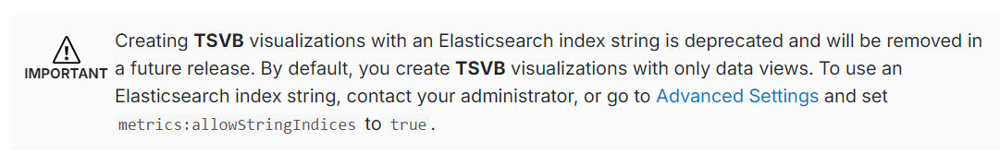
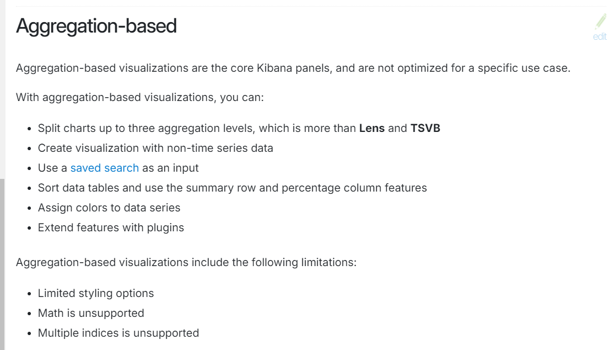

# Kibana dashboard types

- lens
  - metric
  - table
  - bar
  - bar stacked percentage
  - bar stacked
  - h-bar
  - h-bar stacked percentage
  - h-bar stacked
  - area
  - area stacked percentage
  - area stacked
  - line
  - pie
  - donut
  - treemap
  - heatmap
- maps
- ES/QL
- Text(markdown)
- image
- log stream
- links
- SLO
- machine learning
- custom visualization(Vega)
- TSVB(deprecated)      

- aggregation based   

  - area
  - line
  - bar
  - h-bar
  - gauge
  - goal
  - timelion
  - tag cloud
  - metric
  - heatmap
  - pie
  - table

## supported conversion

- lens
  - [x] metric
  - [x] table
  - [x] bar
  - [x] bar stacked percentage -> bar stacked
  - [x] bar stacked
  - [x] h-bar
  - [x] h-bar stacked percentage -> h-bar stacked
  - [x] h-bar stacked
  - [x] area
  - [x] area stacked percentage -> area stacked
  - [x] area stacked
  - [x] line
  - [x] pie
  - [x] donut
  - [ ] treemap
  - [x] heatmap
- [ ] maps
- [ ] ES/QL
- [x] Text(markdown)
- [ ] image
- [ ] log stream
- [ ] links
- [ ] SLO
- [ ] machine learning
- [ ] custom visualization(Vega)
- [ ] TSVB(deprecated)
- aggregation based
  - [x] area
  - [x] line
  - [x] bar
  - [x] h-bar
  - [x] gauge
  - [x] goal -> gauge
  - [ ] timelion
  - [ ] tag cloud
  - [x] metric
  - [x] heatmap
  - [x] pie
  - [x] table

### Assumptions

- unsupported aggregation function will be converted as count
- in single panel, if multiple layers found(ie. multi query) then only first layer will be taken
- if panel title not found, use as `panel [index]` as a title

## completed

- lens
  - [x] metric
  - [x] table
  - [x] bar
  - [x] bar stacked percentage -> bar stacked
  - [x] bar stacked
  - [x] h-bar
  - [x] h-bar stacked percentage -> h-bar stacked
  - [x] h-bar stacked
  - [x] area
  - [x] area stacked percentage -> area stacked
  - [x] area stacked
  - [x] line
  - [x] pie
  - [x] donut
  - [x] heatmap
- [x] Text(markdown)
- aggregation based
  - [x] area
  - [x] line
  - [x] bar
  - [x] h-bar
  - [x] gauge
  - [x] goal -> gauge
  - [x] metric
  - [x] heatmap
  - [x] pie
  - [x] table
